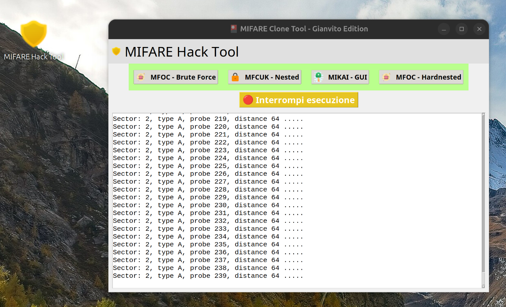

# 🎴 MIFARE Hack Tool - GUI Edition

**Interfaccia grafica avanzata per la clonazione e l'analisi di carte MIFARE Classic 1K**, realizzata con Python + Tkinter e supporto ai tool più noti: `mfoc`, `mfcuk`, `mfoc-hardnested`, `mikai`.

---

## ✨ Funzionalità principali

- ✅ Avvio di attacchi MFOC (brute-force)
- ✅ Avvio di attacchi MFCUK (nested)
- ✅ Integrazione con `mfoc-hardnested`
- ✅ Avvio della GUI Mikai direttamente da interfaccia
- ✅ Output terminale in tempo reale
- ✅ Pulsante per terminare il processo NFC in esecuzione
- ✅ Grafica migliorata: icone, font Windows-style, bottoni eleganti

---

## 📸 Screenshot

Ecco un’anteprima dell'interfaccia grafica in azione:



---

## ⚙️ Requisiti

- Linux (Ubuntu/Debian-based consigliato)
- Lettore NFC compatibile, es. **ACR122U**
- Python 3.x
- Tool NFC:
  - `mfoc`, `mfcuk`, `mfoc-hardnested`, `libnfc`, `pcscd`
- GUI: `python3-tk`, `pillow`

---

## 🧪 Modalità di installazione

### 🔧 Metodo 1 — Script automatico `.sh`

1. Scarica lo script:
   ```bash
   wget https://raw.githubusercontent.com/RazorCopter/MiFareHack/main/InstallazioneMIFARE%20Hack.sh
   chmod +x InstallazioneMIFARE\ Hack.sh
   ./InstallazioneMIFARE\ Hack.sh
   ```

2. Lo script:
   - Installa tutte le dipendenze necessarie
   - Configura `libnfc` per il lettore
   - Clona il progetto da GitHub
   - Compila `mfoc-hardnested`
   - Scarica Mikai `.AppImage`
   - Crea l’icona sul desktop

---

### 📦 Metodo 2 — Pacchetto `.deb`

1. Scarica il pacchetto:
   ```bash
   wget https://github.com/RazorCopter/MiFareHack/releases/latest/download/mifare-gui-setup.deb
   ```

2. Installa con `dpkg`:
   ```bash
   sudo dpkg -i mifare-gui-setup.deb
   ```

3. Avvia:
   - Dal menu: **MIFARE Hack Tool**
   - O da terminale:
     ```bash
     python3 /opt/mifare_gui/mifare_gui.py
     ```

---

## 🧱 Struttura Progetto

```
mifare_gui/
├── mifare_gui.py             # GUI principale
├── icons/                    # Icone PNG
├── mfoc-hardnested/          # Tool compilato localmente
├── mikai.AppImage            # GUI esterna per MIFARE
├── screenshot.png            # Immagine della GUI
├── InstallazioneMIFARE Hack.sh
├── mifare-gui-setup.deb
└── README.md
```


---

## ☕ Supporto


